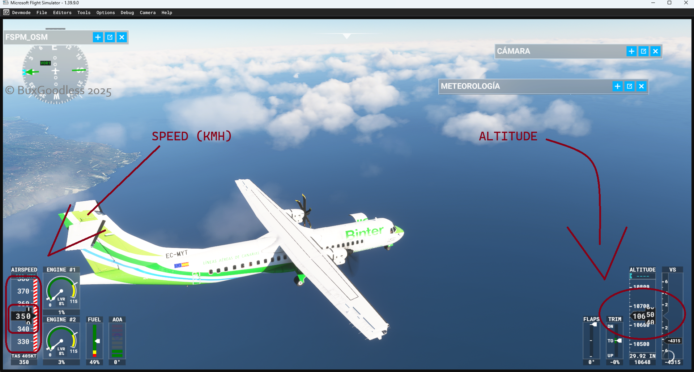

# JAVA-SIMCONNECT
Java SimConnect is a lightweight modular project designed to monitor and interact with your flight simulator.  
Currently compatible with Microsoft Flight Simulator 2020.

This project provides a clean and direct way to subscribe to a wide range of data sources inside Microsoft Flight Simulator. It is built around the idea of giving developers full access to the simulator’s internal state without hiding anything behind unnecessary abstractions. You can subscribe to standard SimVars, custom variables, AI traffic data, camera information, and many of the system events exposed through SimConnect.

The subscription system is designed to be efficient and predictable. Once a variable or event is registered, the client receives updates in real time with minimal overhead. This makes it suitable for tools that need fast feedback, such as monitoring dashboards, camera controllers, AI traffic managers, or any external application that needs to stay synchronized with the simulator.

Support for AI-related data includes reading the state of AI aircraft, their positions, headings, velocities, and other properties exposed by the simulator. Camera data can also be tracked, allowing external tools to react to changes in the user’s viewpoint or to build custom camera systems on top of the simulator.

The goal of the project is to offer a straightforward Java interface that mirrors the flexibility of the native SimConnect API while keeping the codebase easy to understand and extend.

## HOW TO USE?

________________________________________________________________
-1 **Imports**
  The main header of this library is SimConnect.
```java
// EXAMPLE //
import SimConnect.*;
```
THERE ARE MANY IMPORTS YOU CAN DO 
```java
// EXAMPLE //
import SimConnect.*; //main core
//--------------------------------------//
import SimConnect.AircraftRequests;
import SimConnect.CameraState;
import SimConnect.SimCamera;
import SimConnect.SimConnect; //important
import SimConnect.AiAircraftsEvents;
import SimConnect.SimConnectSubscriptions;
import SimConnect.CrearTrafficAI;
import SimConnect.PollingThread;
```
________________________________________________________________

________________________________________________________________
-2 **Check SIM STATUS**
  You can check if the user is connected to the sim or not.
```java
// EXAMPLE //
import SimConnect.SimConnect;
public class Sa { //MAIN CLASS

    public static void main(String[] args) { 
        SimConnect sm = new SimConnect("MyStatusDetector"); //MAKE THE INSTANCE
        if (!sm.SimStatus()) { // CHECK STATUS
            System.out.println("Not Connected");
        } 
        else {
            System.out.println("Connected! Ready to fly ");
        }
    }
}

```
You will see the expected output here
```powershell
WARNING: A restricted method in java.lang.System has been called
WARNING: java.lang.System::loadLibrary has been called by SimConnect.SimConnectBridge in an unnamed module (file:/C:/Users/gabri/OneDrive/Desktop/jav/sa.java)
WARNING: Use --enable-native-access=ALL-UNNAMED to avoid a warning for callers in this module
WARNING: Restricted methods will be blocked in a future release unless native access is enabled

Connected! Ready to fly
PS C:\Users\gabri\OneDrive\Desktop\jav> 
```
If you are not connected you will see this:
```powershell
WARNING: A restricted method in java.lang.System has been called
WARNING: java.lang.System::loadLibrary has been called by SimConnect.SimConnectBridge in an unnamed module (file:/C:/Users/gabri/OneDrive/Desktop/jav/sa.java)
WARNING: Use --enable-native-access=ALL-UNNAMED to avoid a warning for callers in this module
WARNING: Restricted methods will be blocked in a future release unless native access is enabled

Not Connected
PS C:\Users\gabri\OneDrive\Desktop\jav> 
```
________________________________________________________________

________________________________________________________________
-3 **Get/Set SimVars**
To get SimVars we use AircraftRequests. First, we need to add the SimVar to the script.

```java
// EXAMPLE //
import SimConnect.SimConnect;
import SimConnect.AiAircraftsEvents;
import SimConnect.AircraftRequests;
public class Sa2 {

    public static void main(String[] args) {
        SimConnect sm = new SimConnect("MyStatusDetector");
        AircraftRequests aq = new AircraftRequests(sm);

        //ADDING SIMVARS
        aq.add("PLANE ALTITUDE", "feet"); // you can use other units like mile, kilometer, meter, centimeter, etc.
        aq.add("AIRSPEED INDICATED", "knots"); //you can add more simvars 

        System.out.println(aq.get("PLANE ALTITUDE"));
        System.out.println(aq.get("AIRSPEED INDICATED"));

        
    }
}

```
You will see the expected output here
```powershell
WARNING: A restricted method in java.lang.System has been called
WARNING: java.lang.System::loadLibrary has been called by SimConnect.SimConnectBridge in an unnamed module (file:/C:/Users/gabri/OneDrive/Desktop/jav/Sa2.java)
WARNING: Use --enable-native-access=ALL-UNNAMED to avoid a warning for callers in this module
WARNING: Restricted methods will be blocked in a future release unless native access is enabled

110.58666576645693
2.8805973529815674
PS C:\Users\gabri\OneDrive\Desktop\jav>
```

If you don't add any vars you will see this error:
```powershell
WARNING: A restricted method in java.lang.System has been called
WARNING: java.lang.System::loadLibrary has been called by SimConnect.SimConnectBridge in an unnamed module (file:/C:/Users/gabri/OneDrive/Desktop/jav/Sa2.java)
WARNING: Use --enable-native-access=ALL-UNNAMED to avoid a warning for callers in this module
WARNING: Restricted methods will be blocked in a future release unless native access is enabled

Exception in thread "main" SimConnect.SimConnectException: SIMVAR can't get/be a type none ( null in JAVA ), ERR , NOT REGISTERED OR INVALID SIM VAR : PLANE ALTITUDE
        at SimConnect.AircraftRequests.ensure(AircraftRequests.java:26)
        at SimConnect.AircraftRequests.get(AircraftRequests.java:35)
        at Sa2.main(Sa2.java:13)
PS C:\Users\gabri\OneDrive\Desktop\jav> 
```
This error occurs because you didn't add the SimVar (```aq.add("PLANE ALTITUDE", "feet");```).

How to **SET** vars?
First, add the variable and set it:
```java
// EXAMPLE //
import SimConnect.*;

public class Cambio {
    public static void main(String[] args) {

        SimConnect sm = new SimConnect("MiApp");
        AircraftRequests ar = new AircraftRequests(sm);

        ar.add("PLANE ALTITUDE", "feet");
        ar.add("PLANE LATITUDE", "coordinates");
        ar.add("GEAR HANDLE POSITION", "bool");
        ar.add("ATC FLIGHT NUMBER", "string");       

        ar.set("PLANE ALTITUDE", 10649.0 / 3.2808399);   // IMPORTANT: MSFS uses meters internally when teleporting altitude. 
                                                // This line converts feet to meters by dividing by 3.2808399, 
                                                // allowing you to input a custom altitude in feet.


        ar.setBool("GEAR HANDLE POSITION", true);
        ar.setString("ATC FLIGHT NUMBER", "VIV001");

        double alt = ar.get("PLANE ALTITUDE");
        System.out.println("ALT = " + alt);

        sm.close();
    }
}


```

Now the aircraft is flying.


And you will see this output:
```powershell
WARNING: A restricted method in java.lang.System has been called
WARNING: java.lang.System::loadLibrary has been called by SimConnect.SimConnectBridge in an unnamed module (file:/C:/Users/gabri/OneDrive/Desktop/jav/Cambio.java)
WARNING: Use --enable-native-access=ALL-UNNAMED to avoid a warning for callers in this module
WARNING: A restricted method in java.lang.System has been called
WARNING: java.lang.System::loadLibrary has been called by SimConnect.SimConnectBridge in an unnamed module (file:/C:/Users/gabri/OneDrive/Desktop/jav/Cambio.java)
WARNING: Use --enable-native-access=ALL-UNNAMED to avoid a warning for callers in this module
WARNING: Restricted methods will be blocked in a future release unless native access is enabled

ALT = 10649.99998479999
PS C:\Users\gabri\OneDrive\Desktop\jav>

```
________________________________________________________________
________________________________________________________________
-4 **Subscribe SIMVARS**

A subscription allows your script to receive real‑time updates from any SimVar in Microsoft Flight Simulator without lagging the sim or SimConnect.  
Instead of manually calling `get()` inside a loop, the subscription system automatically calls your callback function every time the SimVar value changes.  
This provides continuous, real‑time data without writing your own polling logic or managing threads manually.

A subscription is useful for:
- Live gauges
- Dashboards and HUDs
- Telemetry tools
- Monitoring altitude, speed, heading, gear, etc.
- Any feature that requires constant updates from MSFS

---
```java
// EXAMPLE //
import SimConnect.*;
import SimConnect.AircraftRequests;
import SimConnect.SimConnectSubscriptions;

public class Sa3 {

    public static void main(String[] args) {

        // CREATE THE MAIN SIMCONNECT INSTANCE
        SimConnect sm = new SimConnect("MyApp");

        // CREATE THE REQUEST MANAGER
        AircraftRequests ar = new AircraftRequests(sm);

        // REGISTER THE SIMVAR YOU WANT TO MONITOR
        ar.add("PLANE ALTITUDE", "feet");

        // CREATE THE SUBSCRIPTION SYSTEM
        SimConnectSubscriptions subs = new SimConnectSubscriptions(ar);

        // SUBSCRIBE TO THE SIMVAR AND RECEIVE REAL‑TIME UPDATES
        subs.subscribe("PLANE ALTITUDE", "feet", (name, value) -> {

            // CHECK FOR INVALID VALUES
            if (value == -9999) {
                System.out.println("ERROR: INVALID VALUE");
            } else {
                // PRINT THE UPDATED VALUE
                System.out.println("ALT = " + value);
            }
        });

        // START THE SUBSCRIPTION LOOP (INTERVAL IN MILLISECONDS)
        subs.start(100);

        // KEEP THE PROGRAM RUNNING SO THE LOOP CAN CONTINUE
        while (true) {
            try { Thread.sleep(1000); } catch (Exception e) {}
        }
    }
}
```
OUTPUT BY EXECUTING THIS SCRIPT:
```powershell
WARNING: A restricted method in java.lang.System has been called
WARNING: java.lang.System::loadLibrary has been called by SimConnect.SimConnectBridge in an unnamed module (file:/C:/Users/gabri/OneDrive/Desktop/jav/Sa3.java)
WARNING: Use --enable-native-access=ALL-UNNAMED to avoid a warning for callers in this module
WARNING: Restricted methods will be blocked in a future release unless native access is enabled

ALTITUDE = 38044.26441188362
ALTITUDE = 38044.26441188362
ALTITUDE = 38044.26441188362
ALTITUDE = 38044.26441188332
ALTITUDE = 38044.26441188356
ALTITUDE = 38044.2644118543
ALTITUDE = 38044.26441188366
ALTITUDE = 38044.26441188362
ALTITUDE = 38044.26441188360
ALTITUDE = 37926.771429840504
ALTITUDE = 37926.771429840556
ALTITUDE = 37926.771429840511
ALTITUDE = 37894.09019440023

ALTITUDE = 37795.274953842396
...
```
________________________________________________________________
________________________________________________________________
-1 **Camera**
  SimConnect for Java provides a camera API where you can obtain camera information by importing `SimConnect.CameraState` and `SimConnect.SimCamera`.
```java
// EXAMPLE //
//by GABRIEL

import SimConnect.CameraState;
import SimConnect.SimCamera;

public class TestCameraNative {

    public static void main(String[] args) {

        if (!SimCamera.init()) {//checks if camera is available.
            System.out.println("Cannot init camera");
            return;
        }

        CameraState cs = new CameraState();

        SimCamera.update(cs);

        System.out.println("Getting Camera State");
        System.out.println("CAMERA STATE: "+ cs.cameraState);
        System.out.println("Getting other vars");
        System.out.println("CAMERA SUBSTATE:"+cs.cameraSubState);
        System.out.println("CHASE HEADLOOK:"+cs.chaseHeadlook);
        System.out.println("CHASE MOMENTUM:"+cs.chaseMomentum);
        System.out.println("CHASE SPEED:"+cs.chaseSpeed);
        System.out.println("CHASE ZOOM:"+cs.chaseZoom);
        System.out.println("CHASE ZOOM SPEED:"+cs.chaseZoomSpeed);
        System.out.println("COCKPIT HEADLOOK:"+cs.cockpitHeadlook);
        System.out.println("COCKPIT HEIGHT:"+cs.cockpitHeight);
        System.out.println("COCKPIT MOMENTUM:"+cs.cockpitMomentum);
        System.out.println("COCKPIT SIDE:"+cs.cockpitSide);
        System.out.println("COCKPIT SPEED:"+cs.cockpitSpeed);
        System.out.println("COCKPIT UPPER POS:"+cs.cockpitUpperPos);
        System.out.println("COCKPIT ZOOM:"+cs.cockpitZoom);
        System.out.println("COCKPIT ZOOM:"+cs.cockpitZoom);
        System.out.println("COCKPIT ZOOM SPEED:"+cs.cockpitZoomSpeed);
        System.out.println("DRONE ACTIVE:"+cs.droneActive);
        System.out.println("DRONE FOLLOW MODE:"+cs.droneFollowMode);
        System.out.println("DRONE LOCKED:"+cs.droneLocked);
        System.out.println("GAMEPLAY PITCH YAW:"+cs.gameplayPitchYaw);
        System.out.println("VIEW TYPE:"+cs.viewType);
        System.out.println("VIEW TYPE AND INDEX:"+cs.viewTypeAndIndex);
        System.out.println("VIEW TYPE AND INDEX MAX:"+cs.viewTypeAndIndexMax);
        

        SimCamera.close();
    }
}

```
Expected output when executing this script:
```powershell
WARNING: A restricted method in java.lang.System has been called
WARNING: java.lang.System::loadLibrary has been called by SimConnect.SimCamera in an unnamed module (file:/C:/Users/gabri/OneDrive/Desktop/jav/TestCameraNative.java)
WARNING: Use --enable-native-access=ALL-UNNAMED to avoid a warning for callers in this module
WARNING: Restricted methods will be blocked in a future release unless native access is enabled

Getting Camera State
CAMERA STATE: 2
Getting other vars
CAMERA SUBSTATE:1
CHASE HEADLOOK:6.223239E14
CHASE MOMENTUM:8.291201E-24
CHASE SPEED:4.9107272E19
CHASE ZOOM:-2.5367474E-29
CHASE ZOOM SPEED:2.272833E-9
COCKPIT HEADLOOK:835.82776
COCKPIT HEIGHT:0.0
COCKPIT MOMENTUM:2.0
COCKPIT SIDE:0.5
COCKPIT SPEED:0.0
COCKPIT UPPER POS:0.5
COCKPIT ZOOM:0.099999994
COCKPIT ZOOM:0.099999994
COCKPIT ZOOM SPEED:0.49861276
DRONE ACTIVE:823615499
DRONE FOLLOW MODE:824652049
DRONE LOCKED:1074231337
GAMEPLAY PITCH YAW:2.679227E36
VIEW TYPE:1
VIEW TYPE AND INDEX:0
VIEW TYPE AND INDEX MAX:1056964608
PS C:\Users\gabri\OneDrive\Desktop\jav> 
```
Or execute this line of code to see all parameters 
```java
// EXAMPLE //
//by GABRIEL

import SimConnect.CameraState;
import SimConnect.SimCamera;

public class TestCameraNative {

    public static void main(String[] args) {

        if (!SimCamera.init()) {//checks if camera is available.
            System.out.println("Cannot init camera");
            return;
        }

        CameraState cs = new CameraState();

        SimCamera.update(cs);

        System.out.println(cs);
        
        

        SimCamera.close();
    }
}


```

Expected OUTPUT:
```powershell
WARNING: A restricted method in java.lang.System has been called
WARNING: java.lang.System::loadLibrary has been called by SimConnect.SimCamera in an unnamed module (file:/C:/Users/gabri/OneDrive/Desktop/jav/TestCameraNative.java)
WARNING: Use --enable-native-access=ALL-UNNAMED to avoid a warning for callers in this module
WARNING: Restricted methods will be blocked in a future release unless native access is enabled

CameraState{cameraState=2, cameraSubState=1, viewType=1, viewTypeAndIndex=0, viewTypeAndIndexMax=1056964608, droneActive=0, droneLocked=0, droneFollowMode=0, cockpitZoom=0.099999994, chaseZoom=-2.152E-42, gameplayPitchYaw=0.0}
PS C:\Users\gabri\OneDrive\Desktop\jav> 
```
THERE ARE SOME EXAMPLES:
```java
//EXAMPLE//
// by GABRIEL
// FULL CAMERA MODE DETECTOR FOR MSFS

import SimConnect.CameraState;
import SimConnect.SimCamera;

public class TestCameraNative {

    public static void main(String[] args) {

        // CHECK IF CAMERA NATIVE API IS AVAILABLE
        if (!SimCamera.init()) {
            System.out.println("Cannot init camera");
            return;
        }

        // CREATE A CAMERA STATE HOLDER
        CameraState cs = new CameraState();

        // UPDATE CAMERA STATE FROM MSFS
        SimCamera.update(cs);

        System.out.println("Getting Camera State...");
        System.out.println("RAW CAMERA STATE = " + cs.cameraState);

        // INTERPRET CAMERA MODE
        switch (cs.cameraState) {

            case 2:
                System.out.println("MODE: Cockpit");
                break;

            case 3:
                System.out.println("MODE: External / Chase");
                break;

            case 4:
                System.out.println("MODE: Drone");
                break;

            case 5:
                System.out.println("MODE: Fixed on Plane");
                break;

            case 6:
                System.out.println("MODE: Environment");
                break;

            case 7:
                System.out.println("MODE: Six DoF");
                break;

            case 8:
                System.out.println("MODE: Gameplay");
                break;

            case 9:
                System.out.println("MODE: Showcase");
                break;

            case 10:
                System.out.println("MODE: Drone Aircraft");
                break;

            case 11:
                System.out.println("MODE: Waiting");
                break;

            case 12:
                System.out.println("MODE: World Map");
                break;

            case 13:
                System.out.println("MODE: Hangar RTC");
                break;

            case 14:
                System.out.println("MODE: Hangar Custom");
                break;

            case 15:
                System.out.println("MODE: Menu RTC");
                break;

            case 16:
                System.out.println("MODE: In-Game RTC");
                break;

            case 17:
                System.out.println("MODE: Replay");
                break;

            case 19:
                System.out.println("MODE: Drone Top-Down");
                break;

            case 21:
                System.out.println("MODE: Hangar");
                break;

            case 24:
                System.out.println("MODE: Ground");
                break;

            case 25:
                System.out.println("MODE: Follow Traffic Aircraft");
                break;

            default:
                System.out.println("MODE: UNKNOWN (" + cs.cameraState + ")");
                break;
        }

        // CLOSE CAMERA NATIVE API
        SimCamera.close();
    }
}

```
Expected OUTPUT:
```powershell
WARNING: A restricted method in java.lang.System has been called
WARNING: java.lang.System::loadLibrary has been called by SimConnect.SimCamera in an unnamed module (file:/C:/Users/gabri/OneDrive/Desktop/jav/TestCameraNative.java)
WARNING: Use --enable-native-access=ALL-UNNAMED to avoid a warning for callers in this module
WARNING: Restricted methods will be blocked in a future release unless native access is enabled

Getting Camera State...
RAW CAMERA STATE = 2
MODE: Cockpit
PS C:\Users\gabri\OneDrive\Desktop\jav> 
```
________________________________________________________________
________________________________________________________________
## -5 **MISC UTILS**
I. ***waiter*** : The waiter class is a lightweight timing utility designed to provide safe, controlled delays in Java using the wait() mechanism instead of Thread.sleep(). ```waitMs(ms)```
For example:
```java
//EXAMPLE//
// by GABRIEL
import SimConnect.misc.waiter; //WAITER

public class waiter_example {

    public static void main(String[] args) {

        // CREATE A WAITER INSTANCE
        // THIS OBJECT ALLOWS US TO PAUSE EXECUTION SAFELY USING waitMs()
        waiter w = new waiter();

        System.out.println("START OF SCRIPT");

        // WAIT 1 SECOND
        System.out.println("Waiting 1 second...");
        w.waitMs(1000);
        System.out.println("1 second passed!");

        // WAIT 2 SECONDS
        System.out.println("Waiting 2 seconds...");
        w.waitMs(2000);
        System.out.println("2 seconds passed!");

        // WAIT 0.5 SECONDS
        System.out.println("Waiting 0.5 seconds...");
        w.waitMs(500);
        System.out.println("0.5 seconds passed!");

        // DEMONSTRATE A SEQUENCE
        System.out.println("Starting countdown:");
        w.waitMs(500);
        System.out.println("3");
        w.waitMs(500);
        System.out.println("2");
        w.waitMs(500);
        System.out.println("1");
        w.waitMs(500);
        System.out.println("GO!");

        System.out.println("END OF SCRIPT");
    }
}


```
II. ***soundengine*** : The soundengine is a high‑level audio playback engine designed to make advanced sound control simple, direct, and easy to use in Java.
It allows you to load and play audio files while giving you full control over how the sound behaves in real time.

You don’t need to understand DSP, audio theory, or low‑level audio APIs.
The engine handles everything internally so you can focus on using the sound, not processing it.

Lets try it:
```java
//EXAMPLE//
// by GABRIEL
import SimConnect.misc.soundengine;
import SimConnect.misc.waiter;

public class exa {

    public static void main(String[] args) {

        waiter w = new waiter();          // WAITER CLASS FOR SAFE WAITING USING waitMs()
        soundengine se = new soundengine(); // MAIN AUDIO ENGINE INSTANCE

        // LOAD A SINGLE SOUND (WAV, MP3, OGG IF CODECS ARE INSTALLED)
        se.load("beep", "s.wav"); // "beep" IS THE INTERNAL ID, "s.wav" IS THE FILE

        System.out.println("playing beep");
        se.play("beep");          // PLAY SOUND FROM START
        w.waitMs(4000);           // WAIT 4 SECONDS

        System.out.println("40 vol.");
        se.setVolume("beep", 0.4f); // SET VOLUME TO 40%
        w.waitMs(5000);

        System.out.println("pitch 1.3");
        se.setPitch("beep", 1.3f);  // INCREASE PITCH (SPEED UP)
        w.waitMs(5500);

        System.out.println("playing left");
        se.setBalance("beep", 0.0f); // FULL LEFT CHANNEL
        w.waitMs(5500);

        System.out.println("playing center right");
        se.setBalance("beep", 0.7f); // MOSTLY RIGHT CHANNEL
        w.waitMs(5500);

        System.out.println("playing right ");
        se.setBalance("beep", 1.0f); // FULL RIGHT CHANNEL
        w.waitMs(5500);

        System.out.println("playing center");
        se.setBalance("beep", 0.5f); // CENTER BALANCE
        w.waitMs(5500);

        System.out.println("delay");
        se.enableDelay("beep", true);               // ENABLE DELAY EFFECT
        se.setDelayParams("beep", 300f, 0.45f, 0.35f); // TIME, FEEDBACK, MIX
        w.waitMs(5000);

        System.out.println("reverb");
        se.enableReverb("beep", true);              // ENABLE REVERB EFFECT
        se.setReverbParams("beep", 0.25f, 0.5f);     // MIX AND DECAY
        w.waitMs(5000);

        System.out.println("pause");
        se.pause("beep");       // PAUSE PLAYBACK
        w.waitMs(5500);

        System.out.println("resume.");
        se.resume("beep");      // RESUME PLAYBACK
        w.waitMs(5000);

        System.out.println("stop");
        se.stop("beep");        // STOP AND RESET POSITION
        w.waitMs(500);

        System.out.println("end");
    }
}


```

```java
//EXAMPLE//
// by GABRIEL
// all PARAMS
se.load("beep", "s.wav");          // LOADS THE AUDIO FILE AND ASSIGNS IT THE ID "beep"

se.play("beep");                   // STARTS PLAYBACK FROM THE BEGINNING
se.setVolume("beep", 0.4f);        // SETS THE VOLUME TO 40%
se.setPitch("beep", 1.3f);         // CHANGES THE SPEED/PITCH OF THE SOUND
se.setBalance("beep", 0.0f);       // SENDS THE SOUND TO THE LEFT SPEAKER ONLY
se.setBalance("beep", 0.7f);       // MOSTLY RIGHT SPEAKER (70% RIGHT)
se.setBalance("beep", 1.0f);       // FULL RIGHT SPEAKER
se.setBalance("beep", 0.5f);       // CENTER (LEFT + RIGHT)

se.enableDelay("beep", true);      // ENABLES THE DELAY (ECHO) EFFECT
se.setDelayParams("beep", 300f, 0.45f, 0.35f); // DELAY TIME, FEEDBACK, MIX

se.enableReverb("beep", true);     // ENABLES THE REVERB (ROOM/HALL EFFECT)
se.setReverbParams("beep", 0.25f, 0.5f); // REVERB MIX AND DECAY

se.pause("beep");                  // PAUSES THE SOUND
se.resume("beep");                 // RESUMES THE SOUND
se.stop("beep");                   // STOPS AND RESETS THE SOUND POSITION

w.waitMs(4000);                    // WAITS 4 SECONDS USING THE WAITER CLASS
w.waitMs(5000);                    // WAITS 5 SECONDS
w.waitMs(5500);                    // WAITS 5.5 SECONDS
w.waitMs(500);                     // SHORT WAIT (0.5 SECONDS)

```
________________________________________________________________

#END

